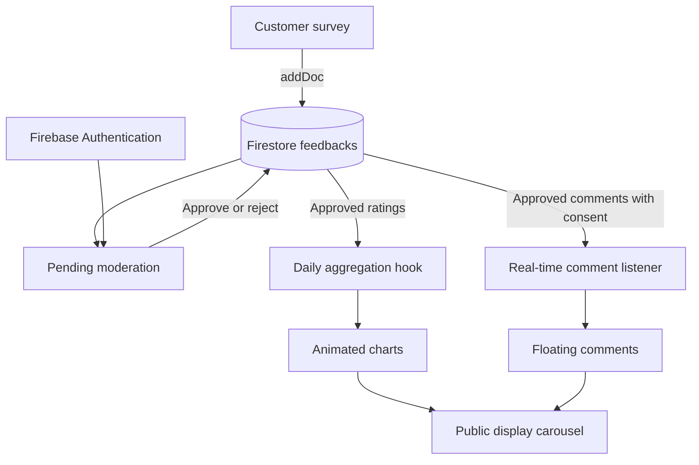

# Retail Feedback Dashboard

A full-stack portfolio project for collecting, moderating, and visualizing in-store customer feedback. Customers submit ratings through a mobile-friendly form, administrators review written responses, and an animated public display presents five-day trends using brand-inspired data visualizations.

> This project was originally developed for the Adidas Ignite selection process. It is a portfolio demonstration and is not an official Adidas product.

## Live Demo

- **Application:** [retail-feedback-dashboard.vercel.app](https://retail-feedback-dashboard.vercel.app/)
- **Customer survey:** [retail-feedback-dashboard.vercel.app/feedback-form](https://retail-feedback-dashboard.vercel.app/feedback-form)
- **Visualization display:** [retail-feedback-dashboard.vercel.app/display](https://retail-feedback-dashboard.vercel.app/display)

The administrator area requires a Firebase Authentication account. Login credentials are intentionally not included in this repository.

## Project Goals

- Provide customers with a fast, mobile-friendly feedback form.
- Store ratings and comments with server-generated timestamps.
- Protect the moderation workflow with authenticated routes.
- Allow administrators to approve or reject written feedback.
- Transform recent responses into animated, easy-to-read visualizations.
- Keep the public display informative when the database has empty dates by using deterministic sample data.

## Main Features

### Customer feedback

- Four 1-5 ratings: product availability, staff service, wait time, and overall experience.
- Optional keyword plus a written comment.
- Explicit consent choice for displaying the comment publicly.
- Required-field validation and a confirmation screen after submission.
- Each new Firestore document starts with `status: "pending"`.

### Administration and moderation

- Email/password authentication through Firebase Authentication.
- Protected React routes for the admin dashboard, pending queue, and moderation history.
- Pending comments can be approved or rejected.
- Moderation records include the administrator and moderation time.
- Previously reviewed feedback can be changed between approved and rejected.

### Public visualization display

- Seven-slide automatic carousel with a 15-second interval.
- Five visualizations based on the latest five calendar days.
- Animated approved comments and a QR-code slide.
- Responsive full-screen layout for desktop displays, tablets, and mobile devices.
- Hybrid real/demo data so the dashboard remains populated while still prioritizing real responses.

## Application Flow



## Backend and Data Layer

The deployed application uses Firebase as its functional backend. The React client communicates with Firestore and Firebase Authentication through the Firebase JavaScript SDK.

### Firestore submission flow

`FeedbackForm.jsx` validates the form and creates a document in the `feedbacks` collection with `addDoc`. `serverTimestamp()` assigns the submission time on the Firebase side instead of trusting the device clock.

Example document shape:

```js
{
  availability: 4,
  staff: 5,
  waitTime: 3,
  experience: 4,
  keywords: "Friendly",
  comments: "The staff was very helpful.",
  consent: "si",
  status: "pending",
  timestamp: Timestamp,
  moderatedBy: "admin@example.com", // added during moderation
  moderatedAt: Timestamp             // added during moderation
}
```

| Field | Type | Purpose |
| --- | --- | --- |
| `availability` | Number (1-5) | Product availability rating |
| `staff` | Number (1-5) | Staff service rating |
| `waitTime` | Number (1-5) | Waiting-time rating |
| `experience` | Number (1-5) | Overall shopping experience |
| `keywords` | String | Optional word describing the experience |
| `comments` | String | Customer's written response |
| `consent` | String | Whether the comment may be shown publicly |
| `status` | String | `pending`, `approved`, or `rejected` |
| `timestamp` | Firestore Timestamp | Server-generated submission time |
| `moderatedBy` | String | Authenticated moderator identifier |
| `moderatedAt` | Timestamp | Date and time of the moderation decision |

### Moderation flow

1. New feedback is stored with a pending status.
2. The admin queue queries documents where `status == "pending"`.
3. An authenticated administrator approves or rejects each response with `updateDoc`.
4. The moderation action adds `moderatedBy` and `moderatedAt`.
5. The history view queries both approved and rejected responses and allows the decision to be changed.

### Authentication and protected routes

Firebase Authentication monitors the active session with `onAuthStateChanged`. The `ProtectedRoute` component prevents unauthenticated visitors from opening the admin pages. User accounts are created and managed directly in Firebase; public self-registration is intentionally unavailable.

Access control must also be enforced through Firestore Security Rules. Hiding an admin route in React is not a replacement for database-level authorization.

### Real-time updates

The floating-comments slide uses Firestore `onSnapshot` to listen for changes. It only displays documents that match both conditions:

```text
status == "approved"
consent == "si"
```

This allows an approved comment to enter the display without rebuilding or redeploying the application.

### Express/Socket.IO scaffold

The `server/` directory contains an Express and Socket.IO scaffold with `GET /api/feedback` and `POST /api/feedback` routes. These endpoints currently return demonstration responses and are not part of the deployed Firestore data flow. They are available as a foundation for a future server-managed API, validation layer, or WebSocket service.

## Data Aggregation and Demo Fallback

All rating charts use the custom `useMetricByDay(metric)` hook.

The hook:

1. Builds a date range covering today and the previous four calendar days.
2. Queries approved, consented Firestore responses from that range.
3. Converts Firestore timestamps to JavaScript dates.
4. Groups valid numeric values by day.
5. Calculates the arithmetic mean for each metric and day.
6. Refreshes the query every 60 seconds.
7. Returns exactly five `{ day, rating, source }` objects to every chart.

For the general score, the application first calculates the average of the four numeric answers in each response:

```text
general = (availability + staff + waitTime + experience) / 4
```

It then averages those general scores by day.

If a date has no real responses, `demoData.js` generates a stable rating between 3.2 and 5.0 from a hash of the date and metric. Because the value is deterministic, it remains unchanged during that day. Real data replaces the generated value only for the dates that contain matching responses. If the Firestore query fails, all five dates fall back to demo values.

## How the Visualizations Work

| Visualization | Data | Implementation |
| --- | --- | --- |
| General rating | Average of all four rating fields | A Recharts `BarChart` uses a custom SVG bar shape. The rounded score determines how many shoebox PNGs are stacked, and a shoe image is placed above each stack. Framer Motion animates the entrance. |
| Product availability | Daily `availability` average | A Recharts `LineChart` connects five days. Custom data-point renderers replace ordinary dots with ball PNGs; the ball size is derived from the rating and CSS keyframes create bounce and idle movement. |
| Staff service | Daily `staff` average | A horizontal Recharts `BarChart` renders custom SVG rows. Bar length is calculated as `rating / 5` of the available width, and the logo animates toward the end of the filled area. |
| Wait time | Daily `waitTime` average | A custom responsive React layout rounds each score to determine the number of overlapping shirt images. Dates appear on label shirts, the rack line shares the same coordinate space as the hangers, and the precise score remains visible below each group. |
| Overall experience | Daily `experience` average | A Recharts `Treemap` uses the rating as `dataKey`, making higher scores occupy larger areas. A custom cell renderer replaces rectangles with shoebox artwork and overlays the numeric score. |
| Approved comments | Firestore comment and keyword fields | An `onSnapshot` listener supplies live approved responses. `useMemo` assigns stable horizontal lanes and staggered delays, while CSS moves cards upward from below the viewport. |

The `DisplayPage` places these visualizations, the comments, and the QR code into a carousel. `AnimatePresence` from Framer Motion handles the transition between slides while the header remains visible.

## Technology Stack

### Frontend

- React 19
- React Router
- Styled Components
- Recharts
- Framer Motion
- Lucide React
- date-fns

### Backend and data

- Firebase Firestore
- Firebase Authentication
- Express scaffold
- Socket.IO scaffold

### Development and deployment

- Create React App / React Scripts
- Git and GitHub
- Vercel
- Node.js 18+

## Project Structure

```text
feedback-dashboard/
    client/
        public/                  # Fonts, brand assets, QR code and metadata
             src/
                     assets/              # Custom chart images
                     components/          # Form, charts, carousel and route guards
                     hooks/               # Firestore aggregation logic
                     pages/               # Public, display and admin screens
                     services/            # Firebase initialization
                     styles/              # Global themes and styles
                    utils/               # Deterministic demo-data generator
             vercel.json              # SPA route rewrites
        server/
            controllers/             # Demonstration API handlers
                 routes/                  # Express feedback routes
                     index.js                 # Express and Socket.IO entry point
                package.json
 README.md
```

## Routes

| Route | Access | Description |
| --- | --- | --- |
| `/` | Public | Project landing page |
| `/feedback-form` | Public | Customer feedback form |
| `/display` | Public | Full-screen visualization carousel |
| `/admin-login` | Public | Administrator login |
| `/admin` | Protected | Admin dashboard |
| `/admin-pending` | Protected | Pending moderation queue |
| `/admin-history` | Protected | Moderation history |

## Local Setup

### Requirements

- Node.js 18 or newer
- npm 9 or newer
- A Firebase project with Firestore and Email/Password Authentication enabled

### Installation

```bash
git clone https://github.com/Fube1971/feedback-dashboard.git
cd feedback-dashboard
npm install
cd client
npm install
```

Configure the Firebase project in:

```text
client/src/services/firebase.js
```

Do not commit administrator passwords, service-account files, or private server credentials. Firebase client configuration identifies the project but does not replace correctly configured Authentication and Firestore Security Rules.

### Run the frontend

```bash
cd client
npm start
```

Open [http://localhost:3000](http://localhost:3000).

### Run the frontend and Express scaffold

From the repository root:

```bash
npm run dev
```

The React application runs on port 3000 and the Express scaffold uses port 5000 by default. The current React data flow still connects directly to Firebase.

### Production build

```bash
cd client
CI=true npm run build
```

## Deployment

The React client is deployed on Vercel. `client/vercel.json` rewrites all paths to `index.html`, allowing React Router URLs such as `/display` and `/feedback-form` to work when opened directly.

Recommended Vercel configuration:

```text
Root Directory: client
Build Command: npm run build
Output Directory: build
Install Command: npm install
```

## Current Limitations

- The Express routes are scaffolding and do not persist data.
- Firestore requests originate from the client, so database rules are essential.
- Admin accounts must be created manually in Firebase Authentication.
- Password recovery is not implemented in the interface.
- Automated test coverage is currently limited.
- Visual assets are optimized for this branded portfolio demonstration.

## Contributors

- Bryam Alexander Barreto Leguizamo
- Daniela Fuentes Bello
- Juan Sebastián Rodríguez Rodríguez

## Asset Disclaimer

Adidas names, logos, fonts, and visual assets belong to their respective owner. They are included solely to document the original technical-test context and must not be reused or redistributed as independent brand assets. This repository does not imply endorsement by or affiliation with Adidas.

## License

The source code is available under the [MIT License](LICENSE). Third-party names and visual assets are excluded from that license and remain subject to their owners' rights.
